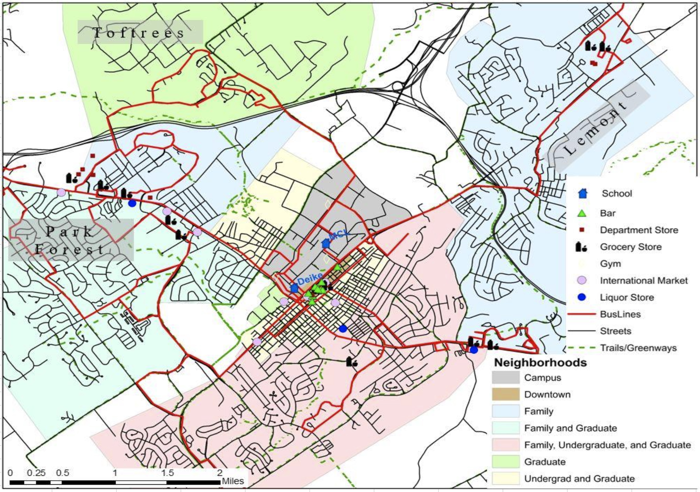

## Housing

If you've accepted an offer or are new to the area, finding housing can seem daunting. We've put together this page to help students learn more about the area, neighborhoods they may be interested in, and ways to find housing.

### The Town of State College
State College is a sweet town with lots to offer! There are great options for [hiking,](https://onwardstate.com/2023/10/19/five-fun-hikes-close-to-state-college/) [biking,](https://www.mtbproject.com/directory/8011558/state-college) [crafting,](https://artallianceofcentralpa.org) and [more](https://happyvalley.com/c/attractions). There are fun summer [farmers markets](https://happyvalley.com/c/farm-markets), occasional [live music](https://www.statecollege.com/events/category/concerts/), and [arts fests](https://arts-festival.com). 

### Neighborhoods Overview

State College has a large undergrad population, so much of the town is devoted to serving them. As such, the area immediately closest to downtown will be convenient but may be noisy from undergrads/frat parties. The further you are from downtown, the quieter it will be. However, lots of the fun activities and bars are located downtown, so living in walking distance to those locations (and the Geology building) is a plus. Living on the south-east side of campus (downtown side) in the outer parts of the yellow shaded area or the inside of the pink shaded area are quiet and still accessible. Reasonable rent in this area is ~$800 per month (2024 estimate).

Tofttrees, in bright green on the map, is a good option. It is significantly cheaper than living by downtown, but it is at least a 10-minute drive from campus, and you'll need to commute to the office and back home after a night out. Reasonable rent in this area is ~$500 per month.

Some students live in Bellefonte because it's cheaper (though farther). A good option if you have a car and want to live in a quieter area.

There are nice parks and outdoors spaces in every neighborhood. Consider checking out the [walnut spring park,](https://www.appoutdoors.com/blog/the-wilderness-of-walnut-springs-park/) [the arboretum,](https://arboretum.psu.edu) or golf course trails. See more [here.](https://www.crpr.org/sites/g/files/vyhlif2986/f/uploads/parks_bikeways_map.pdf)   
### Finding Housing
Finding available housing on places like zillow, apartments.com, or just googling will come up with tons of results. You can sort by the criteria that match what you are looking for, and make selections based on what you see. Big downtown high rises will be more expensive, as will options close to campus. Further away (nothing is ever *that* far here) and independent rentals will be cheaper. Feel free to get in contact with current grad students to ask questions about your location, reasonable rent prices, or good rental companies. 
You can also try to find a house/apartment along the bus routes especially if you don't have a car.

*A few cautionary words to the wise:*
Try to avoid any properties managed/owned by Associated Realty Property Management (ARPM) or Continental Real Estate Management (CREM)
When renting, it's best to get a virtual or in-person tour in real time if possible (to make sure the property is real) If something seems like a scam, you can reach out to any current grad students in the Hadjimichael group to double-check! Also, before you sign a lease, hop on Google Maps and check if you will be neighbors with a frat house or if you'll have any good grocery stores nearby!
### Finding Roommates

If you decide you want roommates, there's a few places to look. First, the Geoscience department sends around a prospective students excel file around March/April. This will have a tab for people looking for roommates/housing to be paired up! Reach out to one of the current Hadjimichael group students if you'd like to see this excel sheet.

Also, there are lots of Facebook housing groups you can use to find roommates or available rentals (across all departments and includes undergrads) [here](https://www.facebook.com/groups/1791579631067235/). [This link](https://onwardstate.com/2023/09/11/freshman-101-your-guide-to-apartment-hunting-in-state-college/) has a few more you can try. Lots of students have had success with these! Be cautious of scams.

### Getting to Campus
State College is a pretty bike friendly town. If you want to bike to campus, it may be helpful to see if housing you're looking at is near a dedicated (no cars) bike route. You can see bike paths [here](https://www.crpr.org/sites/g/files/vyhlif2986/f/uploads/parks_bikeways_map.pdf).
I highly recommend [Freeze Thaw Cycles](https://freezethaw.com) for your bike repair and upkeep needs - they're awesome! Also, the [PSU Bike Den](https://transportation.psu.edu/bike-den) offers free maintenanace clinics and workshops.

The bus is another good option. As mentioned above, try to find a house/apartment along the bus routes especially if you don't have a car. Bus passes for grad students who live a certain distance from campus are $21/month [here](https://transportation.psu.edu/ridepass-graduate-students). Some apartments will include the bus pass in your rent. The bus doesn't go everywhere, and *only the red, white, and blue loops are included in the student pass*. Check out the map [here.](https://catabus.com/system-map/) 

Driving to campus is an option, however finding parking is a hassle. Register for a parking pass at [this link](https://transportation.psu.edu/student-parking). Try to find the day that pass purchasing opens and go to the Parking Portal as quick as you can to get a spot. The West Deck is cheaper and convenient for accessing the Deike building. Hot tip- Parking is free in the Deike lot on weekends 🙏 
### Other considerations
Once you've got a new address, don't forget to request that the USPS forwards your mail to your new location! You can request mail forwarding [here.](https://moversguide.usps.com/mgo/address-info?_gl=1%2aq2nled%2a_gcl_au%2aNzc3MjE0ODM3LjE3MTIxNjIzNDU.%2a_ga%2aMTk3NDE0NDUxNC4xNzEyMTYyMzQ1%2a_ga_3NXP3C8S9V%2aMTcxMjE2MjM0NS4xLjAuMTcxMjE2MjM0NS4wLjAuMA) or by going to a USPS post office. You can read more about the Change-Of-Address process [here](https://www.usps.com/manage/forward.htm). 

If this is a new county for you, be sure to [register to vote](https://www.pavoterservices.pa.gov/Pages/VoterRegistrationApplication.aspx) at your new location! Pennsylvania allows voters to vote by mail, so changing your address and selecting to recieve a mail-in ballot is a great option. In PA, you must register to vote 15 days before the election!
 
State College is a great town for dumpster diving! If you're on a graduate student budget, you'll be able to thrift lots of furniture and other goodies from the street corner, or one of the many [thrift stores](https://onwardstate.com/2023/12/08/your-guide-to-thrifting-in-the-state-college-area/) in town.

