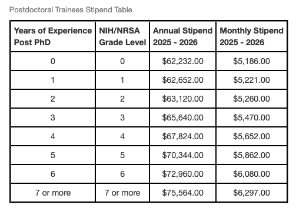

## Salary Transparency

The Hadjimichael Group is committed to salary transparency for graduate students and post-doctoral students alike. The group's policy is to follow NIH standards. Be aware, however, that pay grades and policies are updated by the graduate school from year to year.

### [Graduate Student Pay](https://guru.psu.edu/resources/rates-and-schedules/stipends-for-graduate-assistants?range=20252026&submit=Submit)

Graduate student pay information has often been difficult to find or understand. Here are a few key pieces of information to remember:

-   Direct deposits from the university are made on the **last weekday of every month**

-   Your first paycheck as an incoming student will arrive on the **last day of August.** As a result, you may need to prepare ahead in order to cover expenses (e.g., rent) for that first month after you arrive in State College

-   Almost all graduate students come in classified as "half time" by the university. If you see this language, do not be confused, as it just reflects your status as a research assistant (RA) or teaching assistant (TA) whose other time is filled by coursework

    -   A half time graduate student is expected to contribute 20 hours per week to research. The remaining 20 hours per week go toward 9-12 credits of courses per semester

-   You will sign a contract per semester (and summer) that you are here. That contract will detail your pay grade **(currently Grade 14, as of Fall 2025)** and the time period of your appointment, and will specify the total stipend you will receive in that time

-   As shown in the chart below, **summer pay differs from in-semester pay rates**

Shown below are the pay grades for graduate students on a half time (20 hour / week) appointment.

### [Postdoctoral Associate Pay](https://guru.psu.edu/resources/rates-and-schedules/stipends-for-postdoctoral-appointments?range=20242025&submit=Submit)

New postdoctoral associates must receive a minimum annual salary of \$61,008.00 (\$5,084.00 / month). Shown below are the pay grades for postdoctoral associates depending on their experience level. For more information, visit the link or contact the PSU Office of Postdoctoral Affairs.

### Penn State Health Insurance: [Student Health Insurance Plan (SHIP)](https://studentaffairs.psu.edu/health-insurance/graduate-assistant-fellows-and-trainees)

As graduate students at Penn State, we are lucky that the student health insurance is quite good, and covers medical, dental, and vision. International students must submit proof of health insurance coverage, or purchase SHIP. Check the website for eligibility requirements.

Note that students are **automatically enrolled** in SHIP, and **must choose to waive or accept the coverage**. The deadline to accept or waive is often in early September. In the U.S., most children are allowed to remain on their parents health insurance plans until 26 years of age, so many students will waive coverage for the first few years of their studies at PSU.

### [Penn State Volunteer Income Tax Assistance (VITA)](http://www.psuvita.org)

Taxes as a graduate student or postdoc can be tricky to navigate. Most new members come in and are paid for by Antonia as part of a project, but some come in with grants and fellowships. For international students in particular, tax situations can be confusing. Luckily, Penn State offers a **FREE** service to aid PSU students and employees during tax season. In the United States, taxes are due on April 15th of every year, and so PSU VITA begins to offer services beginning at the end of January.

The volunteers at PSU VITA are certified by the US Internal Revenue Service (IRS) to provide these services, and are located in the **Wagner Building, room 216**.

### Contacts

#### *Student Health Insurance Plan (SHIP)*

-   Address: 228 Bank of America Career Services Center, 566 Eisenhower Road University Park, PA

-   814-865-4847

-   [uhs-insurance\@psu.edu](uhs-insurance@psu.edu)

-   By appointment only

#### *PSU VITA Tax Services*

-   216 Wagner Building University Park, PA, 16802
-   Open Late January to April